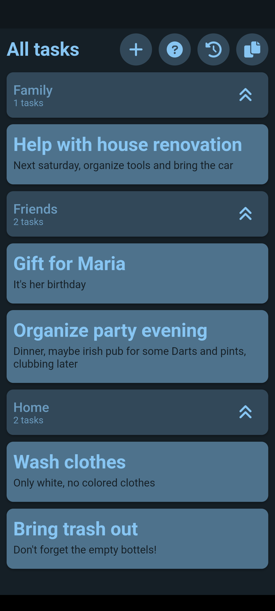
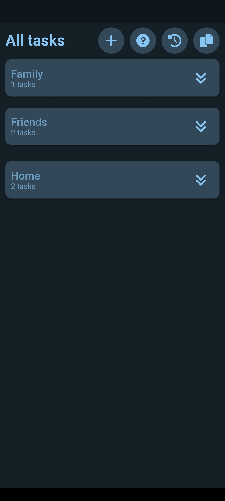
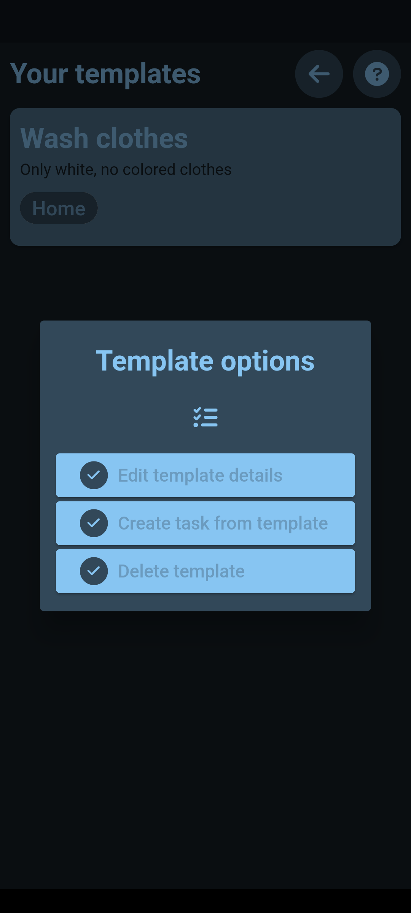
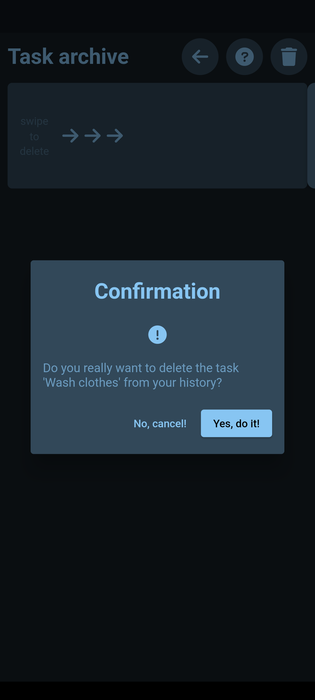

# Task Reminder

Task Reminder is an app to create and track recurring tasks on a daily basis. You will receive a reminder every day at 9am about the amount of open tasks. The UI is quite simple and there is no cloud service or tracking involved.

## Features

- Create daily tasks and task groups
- Define templates to create frequent tasks more quickly
- Reminder for not completed tasks of the day
- Works completely offline
- Storage on local device
- No data collection

## Tech stack

- Framework/Language: [Flutter/Dart](https://flutter.dev/)
- State management: [Riverpod](https://riverpod.dev/)
- Dependency Injection: [Get](https://pub.dev/packages/get)
- Data storage: [Hive](https://pub.dev/packages/hive)
- Architecture: [MVVM](https://medium.com/flutterworld/flutter-mvvm-architecture-f8bed2521958)
- Notifications: [Flutter Local Notifications](https://pub.dev/packages/flutter_local_notifications#scheduled-android-notifications)

## Screenshots

  
  
  
  

## Apps

You need to download the code and the compile the app yourself. Connect your device and run the command `flutter build apk` (Android) or `flutter build ios` (iOS) followed by a `flutter run`. The app will be deployed on your phone and is ready to use. More information can be found [here](https://docs.flutter.dev/get-started/test-drive?tab=terminal).

## History

The app was initially developed during a blog series documenting the implementation process of a Flutter application from scratch. The original code is still available as well as all related blog posts. If you are interested, check out the [original repository](https://github.com/xeladu/flutter_app_example).

## About me

- Follow me on [Medium](https://xeladu.medium.com)
- Visit my [QuickCoder blog](https://quickcoder.org)
- Check out my [digital products](https://xeladu.gumroad.com)
